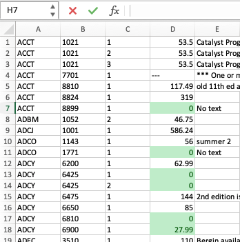

# Course Materials Cost Estimator

## Contents

- [Objective](#objective)
- [Cost Estimation](#cost-estimation)
- [Instructions for Use](#instructions-for-use)
- [HEOA Spreadsheet](#heoa-spreadsheet)
- [Notes](#notes)

## Objective

The objective of this tool is to efficiently estimate the cost of ownership for new materials required for all sections of all courses.

## Cost Estimation

- The tool reads an HEOA spreadsheet and totals the **cost of ownership for new materials**, per section, for all courses
- Materials may be textbooks or digital media, or any other supporting item
- The _highest_ cost of any given material is used. For example, if there are three options for the same book, the most expensive is used in case that is the only item available.
- The tool tries to identify duplicate items. If there are two books, _The Instruction Book_ and _Instruction Book_, the tool will consider them the same because the important words in the title are _Instruction_ and _Book_. _Instruction Book_ and _Book Instruction_ are presumed to be different because the words are in a different order.
- It's assumed the price for rentals is less than purchase, if the highest cost option is a rental, in all likelihood, rental is the only option and it will be noted as such in the output
- The accuracy of the estimation will vary based on the materials - items such as clothing where multiple sizes are listed may not be accurately calculated.

## Instructions For Use

### HEOA Spreadsheet

- If you have an HEOA spreadsheet, upload the file
- If you have FTP credentials for the HEOA feed, enter them and click _Go_
- A preview of the spreadsheet is displayed, whether you uploaded it or got it from the feed. The preview allows you to quickly check whether the file you're working with is the one you expected, it shows every row of data, but not every cell in the row.

### Downloading the estimated cost of materials

The **Download** button will deliver an Excel spreadsheet with the estimated cost of materials for all sections in the HEOA file. You may open it or download it.

## Cost Estimation Spreadsheet

### Highlighting

There is no evaluation mechanism in the spreadsheet. The data may be analyzed any way.

You may use Excel's Conditional Formatting to highlight rows in the spreadsheet. These instructions describe how to emphasize the courses with an estimated material cost of less than \$40.

1. Select column D  
   
1. Click on _Conditional Formatting_  
   
1. Choose how you would like to highlight the estimated cost of materials  
   
1. Example display  
   

The spreadsheet can not be styled or customized further without a paid license. Ref: <https://gist.github.com/SheetJSDev/24b8acd317d01999d721b38de7c53021>

### Notes

Notes in the HEOA file are included in the output, they may be preceded by additional notes as follows:

1. _No text_ - no materials are listed for the section, which implies the cost of materials is zero
1. _\*\*\* One or more of the materials is a CHOICE \*\*\*_ - the cost of materials cannot be estimated  
   because students have the option to choose between different materials. The total cost of materials will be \-\-\-.
1. _RENTAL_ - if materials are rental-only - the cost will be reported as _RENTAL_

Built with: <https://circleci.com/gh/chrisvfritz/vue-enterprise-boilerplate/tree/master>
